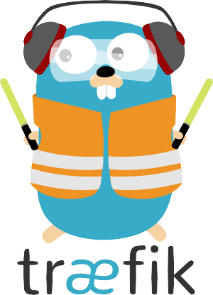

<h1>
  <p align="center" width="100%">
    
    </br>
    Træfik v3
  </p> 
</h1>

<h2> 
  <p align="center" width="100%">
    Un proxy inverso con certificados SSL para redirigir las peticiones entrantes a sus respectivos servicios mediante HTTPS
  </p>
</h2>

<h3>
  <p align="left" width="100%">
    Basado en la imagen de <a href="https://traefik.io">Træfik</a>: <a href="https://github.com/traefik/traefik">traefik</a>
  </p>
</h3>

<!-- [](README.md) -->

<h3>
  Contenido:
</h3>

- [Estructura](#estructura)
- [Descripción](#descripción)
  - [*Espera...¿Qué es un middleware?*](#esperaqué-es-un-middleware)
  - [*¿Y una chain?*](#y-una-chain)
  - [*Autentificación básica (de momento)*](#autentificación-básica-de-momento)
  - [*Otras observaciones*](#otras-observaciones)
  - [*Variables de entorno*](#variables-de-entorno)
  - [*Antes de empezar*](#antes-de-empezar)
    - [*Obtención del token API de Cloudflare*](#obtención-del-token-api-de-cloudflare)
- [Arranque del contenedor](#arranque-del-contenedor)

## Estructura

    traefik/
      ├─ docker-compose.yml               → archivo docker
      ├─ .env                             → variables de entorno
      ├─ traefik.yml                      → configuración estática
      ├─ acme/
      │    └─ acme.json                   → certificado SSL
      ├─ logs/
      │    ├─ access.log                  → registro de acceso
      │    └─ traefik.log                 → registro de apliación
      └─ rules/                           → configuración dinámica
           ├─ external.yml                → redirección a servicios no-docker
           ├─ middlewares.yml             → middlewares (ver más adelante)
           ├─ middlewares-chains.yml      → middlewares encadenados (ver más adelante)
           └─ tls-opts.yml                → opciones de TLS

## Descripción

Los archivos `docker-compose.yml` y `.env` no necesitan presentación, son los archivos que contienen todas las instrucciones y variables para crear el contenedor de Traefik.

El archivo `traefik.yml` recoge la configuración de Traefik **_"estática"_**, esto es, la configuración que no cambia con el tiempo (o que cambia muy raramente).

La carpeta `acme/` que contiene el archivo `acme.json` es donde se almacenan los certificados SSL generados por Let's Encrypt. Este archivo tiene un tratamiento especial, ya que deberemos crearlo manualmente y asignarle permisos de lectura y escritura **sólo** al usuario que ejecuta el contenedor de Traefik, mediante `chmod 600 acme.json`

La carpeta `logs/` contiene los archivos de registro de acceso `access.log` y de la aplicación de Traefik `traefik.log`. Se puede funcionar sin ellos, pero es recomendable tenerlos a mano para depurar problemas o utilizarlos para que otros contenedores como por ejemplo [**crowdsec**](../crowdsec), busquen patrones de comportamiento sospechosos. Estos archivos también tendremos que crearlos manualmente, ya que Docker sólo es capaz de crear directorios si es necesario, pero no archivos.

Por último, la carpeta `rules/` contiene la configuración **_"dinámica"_** de Traefik. Dinámica en el sentido de que cada archivo que soltemos dentro será leído por Traefik y se aplicará la configuración que en ellos se indica. Y dinámica en el sentido de que podemos crear nuevos servicios (o eliminarlos) con cierta asiduidad, como es muy probable que ocurra en el entorno de un Homelab. Hablemos primero de `external.yml` y `tls-opts.yml` que son los más sencillos de explicar.

  * `external.yml`: Contiene las reglas para redirigir a servicios que no son contenedores de Docker. Por ejemplo, si tenemos un servicio web en un servidor remoto, podemos indicarle a Traefik mediante éstas reglas a dónde tiene que ir cada petición. Este archivo en realidad es solo un ejemplo de cómo hacerlo, ya que podemos crear un archivo para cada servicio, uno para todos los servicios o una combinación de ambos.
  * `tls-opts.yml`: Contiene un conjunto de opciones de uso común de TLS (Transport Layer Security, o seguridad de la capa de transporte).

De entre todos los archivos que hay dentro de `rules/` hay dos que son de especial importancia: `middlewares` y `middlewares-chains`. 

### *Espera...¿Qué es un middleware?*

Los middlewares son trozos de código que se intercalan entre la petición y el servicio. Son una forma de "interceptar" las peticiones entrantes y realizar cambios en ellas, normalmente necesarios para que lo que le llegue al servicio sea entendible por éste y por tanto que funcione.

### *¿Y una chain?*

Habitualmente los servicios hacen uso de los mismos middlewares una y otra vez. Una chain, o cadena en inglés, es una forma de agruparlos bajo un mismo nombre y así aplicarlos de manera conjunta a cada servicio. Dentro de las etiquetas de cada servicio podremos especificar la chain que queramos que se aplique.

### *Autentificación básica (de momento)*

No vamos a dejar expuesto nuestro panel de traefik a cualquiera, por lo que de momento y hasta que tengamos un sistema de autentificación más robusto ([Authelia](../authelia/)), vamos a utilizar la autentificación básica.

Crearemos un archivo en un lugar seguro y en él pondremos un par usuario:contraseña. Si queremos añadir más usuarios escribiremos una línea por cada uno.

La contraseña tiene que estar encriptada con los estándares MD5, SHA1 o BCrypt. Aunque podemos hacerlo nosotros por nuestra cuenta, por experiencia he comprobado que es mejor usar la utilidad `htpasswd` que viene incluida con Apache, o una versión online de la misma si no queremos instalar nada. Además, como se supone que es una medida temporal hasta que configuremos Authelia, no vamos a preocuparnos en exceso por el tema.

Si nuestro usuario es `user` y la contraseña `PASSWORD`, escribiremos en nuestro archivo el nombre del usuario seguido de dos puntos y seguido la contraseña encriptada, **sin dejar espacios entre ninguno de ellos.** 

```
user:PASSWORD se convierte en:

user:$apr1$akhbl7id$BDDd7dzu.xFfgUBPTYFTY1
```
>

Finalmente pasaremos la ruta al archivo dentro de `middlewares.yml`:

```yaml
http:
  middlewares:
    middlewares-basic-auth:
      basicAuth:
        usersFile: "/ruta/archivo/seguro/.users"
```

### *Otras observaciones*

Como hemos visto, el uso de la carpeta `rules/` permite soltar archivos dentro de ella y que Traefik los lea y aplique sobre la marcha. Esto no es así para cualquier subcarpeta que haya dentro, por lo que no es recursivo. Si nos gusta tener todo ordenado agrupado por carpetas en éste caso no funcionará.

En el archivo `traefik.yml` las líneas 80 y 81 definen los servidores de Let's Encrypt. El primero es el servidor de ensayo y el segundo el real. Durante el primer arranque, y hasta que veamos que podemos obtener un certificado (`cat acme/acme.json`) debemos tener el servidor de ensayo descomentado y el real comentado. Esto es porque el servidor real tiene un contador de intentos y si tenemos muchos fallos seguidos nos pueden banear durante unas horas (o incluso un día). El servidor de ensayo emite un certificado que aunque no es válido para producción, nos permite probar que todo funciona correctamente antes de solicitar el certificado real. Una vez obtenido el certificado, podemos comentar el servidor de ensayo y descomentar el real.

El contenedor hace uso de [socket-proxy](../socket-proxy/) para mayor seguridad, pero contiene las líneas necesarias (comentadas) para funcionar sin él.

Utiliza [Cloudflare](cloudflare.com) como resolvedor DNS, pero es posible utilizar cualquier otro.

### *Variables de entorno*

* `PUID` y `PGID` son los identificadores de usuario y grupo en formato numérico (ejecutar `id` para conocerlos)
* `TZ` es la zona horaria en formato `Continente/Ciudad`. [Listado de zonas](https://www.joda.org/joda-time/timezones.html)
* `DOCKERDIR` es el directorio que contiene todos los servicios de Docker.
* `DOMAINNAME` es el nombre de nuestro dominio.
* `CLOUDFLARE_EMAIL` es el correo con el que tengamos el dominio registrado en Cloudflare.
* `CF_DNS_API_TOKEN` es un identificador para demostrar que somos dueños del dominio y así obtener los certificados.

### *Antes de empezar*

* Crear la estructura arriba indicada, con la especial atención de los permisos de `acme.json`. **Si no son 600 (rw- --- ---) Traefik no arrancará.**

* La red `proxy` debe estar presente antes de arrancar el contenedor de Traefik. Se puede comentar la línea `external: true` en `docker-compose.yml` y Traefik la creará automáticamente, pero esto tiene el inconveniente de que si el contenedor falla o no está en servicio, el resto de servicios que la tienen definida también caerán. Por eso es mejor crearla manualmente:

```bash
docker network create proxy
```
>

* Descomentar la línea 80 y comentar la 81 del archivo `traefik.yml`. Ciertos usuarios de Cloudflare han comentado que también es necesario deshabilitar el Proxy (nube naranja), pero en mi caso no hizo falta.

* Si queremos usar el panel de Traefik desde el exterior, tendremos que crear un registro CNAME en nuestro DNS que apunte hacia él. En `docker-compose.yml` se indica que el panel estará disponible en `https://traefik.$DOMAINNAME`.

#### *Obtención del token API de Cloudflare*

* Acudimos al panel de control de Cloudflare y hacemos clic en nuestro perfil en la esquina superior derecha.
* En el panel izquierdo, bajo la sección "Mi perfil", hacemos clic en "Tokens API".
* Abajo del todo, en "Crear token personalizado", hacemos clic en "Comenzar".
* En "Nombre del token", le asignamos un nombre. El nombre en sí no importa, es solo para nuestra propia referencia.
* En "Permisos", queremos dos: "Zona → Zona → Leer" y "Zona → DNS → Editar".
* En "Recursos de zona", seleccionamos "Incluir → Zona específica" y seleccionamos nuestro dominio.
* Hacemos clic en "Continuar al resumen".
* Se nos presentará un resumen del token con todas las opciones que hemos seleccionado en los pasos anteriores. Si estamos de acuerdo, hacemos clic en "Crear token"
* **ATENCION**: El código sólo aparece una vez. Si no lo copiamos en éste momento por cualquier causa, debemos borrarlo y crear uno nuevo.
* Copia el token y pégalo en la variable de entorno `CF_DNS_API_TOKEN` del archivo `.env`.

## Arranque del contenedor

```bash
# arrancamos Traefik en segundo plano
docker compose up -d

# examinamos los registros para ver si hay algún problema (CTRL+c para salir)
docker logs traefik -f
```
</br>

Pasados unos minutos comprobamos el contenido de acme/acme.json para ver si hemos obtenido el certificado de prueba. Si es así revertiremos las líneas 80 y 81 del archivo `traefik.yml` (comentamos la 80 y descomentamos la 81) y reiniciaremos el archivo acme/acme.json con el siguiente comando:

```bash
: > acme/acme.json && chmod 600 acme/acme.json
```
>

**Importante:** Tanto `:` como `>` son parte del comando, **¡no dejéis de copiarlo!**

Por último volvemos a arrancar Traefik:

```bash
# forzamos el arranque para que vuelva a crear el contenedor desde cero
docker compose up -d --force-recreate
```

</br>

<h3>
  ¡Listo! Ya podemos ir a nuestros servicios por su nombre y con certificados SSL.
</h3>